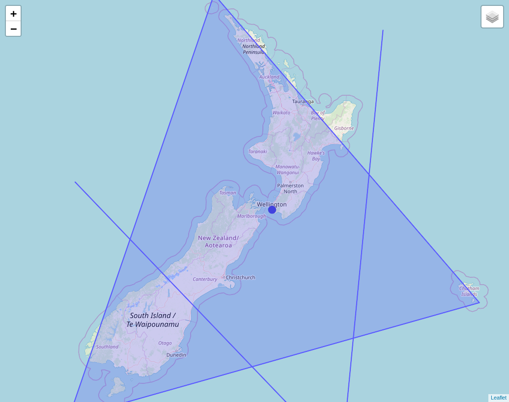

# Smindel\GIS\Control\WebMapTileService



The configuration of the WebMapTileService applies to all Web Map Tile Services you expose. They can be overwritten in [your DataObject classes](DataObject-Example.md).

## Configuration

### private static WebMapTileService::$tile_buffer

Buffer around the tile in pixel. Either an integer to be used on all four sides, an array with two integers for horizontal and vertical buffer or an array of four to set a buffer for all four sides of the tile individually.

The data query for this tile will be extended by this value in order to include DataObjects that are close to the current tile and their rendering extends into the current tile. E.g. If the rendering draws a 5 pixel radius around point, a point on the border between tiles would only be rendered on one of the tiles, the circle would appear only partially with no buffer. With a buffer of 5 the neighboring tile would render the point too and the remaining portion of the circle would be displayed.

This can also help, when you are rendering text. E.g. if you are rendering city names to the right of the city's location you have to have a large enough left buffer but all other buffers can be small.

Because large buffers can be very expensive on large data sets, you want to make your buffers as large as necessary and as small as possible, hence the 4 value array option.

Default is 5

### private static WebMapTileService::$tile_size

Tile size. The default is 256

### private static WebMapTileService::$wrap_date

How to wrap around the date line. The default is true and wraps

### private static WebMapTileService::$cache_path

Path to the cache directory. Paths are absolute or relative to TEMP_PATH . '/..'. Default is 'tile-cache'

### private static WebMapTileService::$cache_ttl

Maximum age of cached tiles in seconds. If set to a falsish value the cache is turned off. Default is 0

### private static WebMapTileService::$default_style

Default rendering style. Applies to all WebMapTileService for all DataObjects but can be overwritten in [your own DataObject](DataObejct-Example.md)

Deafult is
    [
        'gd' => [
            'backgroundcolor' => [0, 0, 0, 127],
            'strokecolor' => [60, 60, 210, 0],
            'fillcolor' => [60, 60, 210, 80],
            'setthickness' => [2],
            'pointradius' => 5,
        ],
        'imagick' => [
            'StrokeOpacity' => 1,
            'StrokeWidth' => 2,
            'StrokeColor' => 'rgb(60,60,210)',
            'FillColor' => 'rgba(60,60,210,.25)',
            'PointRadius' => 5,
            'IconFile' => '[uups]',
            'IconAnchor' => 'center south',
            'IconOffset' => [0, 0],
            'TextColor' => 'rgb(0,0,0)',
            'TextAnchor' => 'center south',
            'TextOffset' => [0, 0],
        ],
    ]

### private static TileRenderer::$class

Set to Smindel\GIS\Service\ImagickRenderer for more rendering features.

Default is 'Smindel\GIS\Service\GDRenderer'

### DataObject config

The service can just be turned on in the DataObject class with the default settings like this:

```php
private static $webmaptileservice = true;
```

... or control one or all configurable aspects:

```php
private static $webmaptileservice = [
    'default_style' => [
        'gd' => [
            'backgroundcolor' => [0, 0, 0, 127],
            'strokecolor' => [60, 60, 210, 0],
            'fillcolor' => [60, 60, 210, 80],
            'setthickness' => [2],
            'pointradius' => 5,
        ],
        'imagick' => [
            'StrokeOpacity' => 1,
            'StrokeWidth' => 2,
            'StrokeColor' => 'rgb(60,60,210)',
            'FillColor' => 'rgba(60,60,210,.25)',
            'PointRadius' => 5,
        ],
    ],
    'geometry_field' => 'Location',     // set geometry field explicitly
    'searchable_fields' => [            // set fields that can be searched by through the service
        'FirstName' => [
            'title' => 'given name',
            'filter' => 'ExactMatchFilter',
        ],
        'Surname' => [
            'title' => 'name',
            'filter' => 'PartialMatchFilter',
        ],
    ],
    'code' => 'ADMIN',                  // restrict access to admins (see: Permission::check())
    'record_provider' => [              // callable to return a DataList of records to be served
        'City',                         // receives 2 parameters:
        'record_provider'               // the HTTPRequest and a reference which you can set to true
    ],                                  // in order to skip filtering further down in the stack
    'tile_size' => [256, 256],
    'tile_buffer' => 5,
    'wrap_date' => true,
    'cache_path' => 'tile-cache',
    'cache_ttl' => 3600,
];
```

## Accessing the endpoint

In order to access the endpoint for the tiles you have to use the namespaced class name with the backslashes replaced with dashes:

    http://yourdomain/webmaptileservice/VendorName-ProductName-DataObjectClassName/Z/X/Y.png

If you want to filter records, you can do so by using the configured or default search fields. You can even use filter modifiers:

    .../DataObjectClassName/Z/X/Y.png?FieldName:StartsWith:not=searchTerm

Map frontends like Leaflet or Openlayers usually supply variable names for Z (Zoom), X and Y. For leaflet that would look like this:

```javascript
L.tileLayer('http://yourdomain/webmaptileservice/City/{z}/{x}/{y}.png').addTo(map);
```

If you set the special query parameter debug=1 the tile will be rendered with debugging info like borders, Z, X and Y values and the number of records that have been rendered.

## Custom tile rendering

Additional to sensible rendering defaults and the option to configure them system wide or for individual DataObject classes, you may not find your particular need covered. In this case you can implement `renderOnWebMapTile($tile)` and use `$tileCoords = $tile->getRelativePixelCoordinates(GIS::of(static::class));` to retrieve the your geo's pixel coordinates for the tile. Checkout the [example](DataObject-Example.md).
